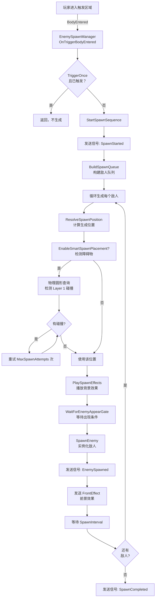
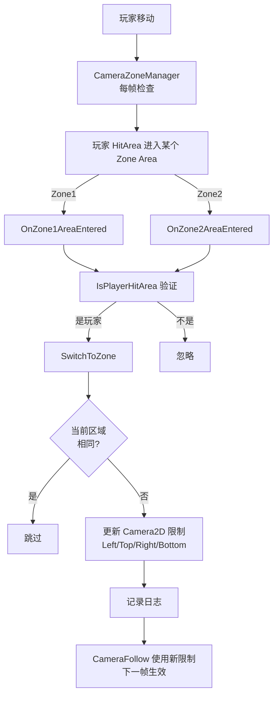

# 系统架构关系图

## 1. 敌人生成流程



## 2. 摄像头区域切换流程



## 3. 碰撞层关系图

```
┌─────────────────────────────────────────────────────┐
│           Godot 物理碰撞系统                        │
│                                                     │
│  每个物体有两个属性:                               │
│  • CollisionLayer (我在哪个层？)                    │
│  • CollisionMask  (我检测哪些层？)                  │
└─────────────────────────────────────────────────────┘

┌──────────────────────────────────────────────────────┐
│              项目碰撞层分配                         │
├──────────────────────────────────────────────────────┤
│ Layer 0 │ PLAYER          │ 玩家身体                 │
│ Layer 1 │ FURNITURE       │ 家具/环境障碍物          │
│ Layer 2 │ ENEMY           │ 敌人身体                 │
│ Layer 3 │ PLAYER_ATTACK   │ 玩家攻击区域             │
│ Layer 4 │ PICKUP_AREA     │ 可拾取物品               │
└──────────────────────────────────────────────────────┘

伤害检测碰撞配置示例：

  玩家 AttackArea              敌人 HitBox
  ┌──────────────┐            ┌──────────────┐
  │Layer:   0    │            │Layer:   2    │
  │Mask:   (1<<2)├───检测────→│              │
  └──────────────┘            └──────────────┘

敌人生成智能检测示例：

  EnemySpawnManager
  ObstacleCheckMask = (1u << 1)
       ↓ 检测 Layer 1 ↓
    ┌──────────────────┐
    │ 家具/墙体/障碍物  │
    │ (Layer 1)        │
    └──────────────────┘
    如有碰撞 → 重新尝试位置
```

## 4. 完整场景组织结构

```
Stage_2.tscn (根场景)
│
├── CameraZoneManager ⭐
│   ├── Properties:
│   │   ├── TargetCamera: Camera2D
│   │   ├── Player: MainCharacter
│   │   └── CameraZones[]: 多个相机区域定义
│   └── Signals:
│       └── (通过 Area2D 间接)
│
├── World
│   ├── MainCharacter
│   │   ├── Sprite2D
│   │   ├── CollisionShape2D (Layer 0)
│   │   ├── Camera2D (受 CameraZoneManager 管理)
│   │   ├── HitArea (Area2D, Layer 0)
│   │   ├── AttackArea (Area2D, Layer 0, Mask 指向 Layer 2)
│   │   ├── ItemAttachment
│   │   │   └── EquippedAttackArea (动态)
│   │   └── 其他组件...
│   │
│   ├── CameraZones (触发区域)
│   │   ├── Zone1_Area2D (触发玩家进入时切换到 Zone 1)
│   │   └── Zone2_Area2D (触发玩家进入时切换到 Zone 2)
│   │
│   ├── EnemySpawns
│   │   ├── EnemySpawnManager_Left
│   │   │   ├── TriggerArea (检测玩家)
│   │   │   ├── EnemyScene: Enemy_A1_zhuA.tscn
│   │   │   ├── SpawnBackEffectScene
│   │   │   └── SpawnFrontEffectScene
│   │   │
│   │   └── EnemySpawnManager_Right
│   │       └── ... (同上)
│   │
│   ├── Enemies (所有生成敌人的父节点)
│   │   ├── Enemy_0 (生成后的敌人)
│   │   ├── Enemy_1
│   │   └── ...
│   │
│   ├── Walls/Obstacles (Layer 1)
│   │   ├── StaticBody2D (家具/环境)
│   │   └── ...
│   │
│   └── Environment (其他视觉元素)
│
└── UI
    └── 游戏 UI 元素
```

## 5. 敌人生成信号流

```
┌─────────────────────────────────────────────────────────┐
│ EnemySpawnManager 信号通信图                            │
├─────────────────────────────────────────────────────────┤
│                                                         │
│  玩家进入触发区域                                       │
│          ↓                                              │
│  TriggerArea.BodyEntered                               │
│          ↓                                              │
│  OnTriggerBodyEntered()                                │
│          ↓                                              │
│  ┌──────────────────────────────────────────┐         │
│  │   发送信号: SpawnStarted                 │         │
│  └──────────────────────────────────────────┘         │
│          ↓                                              │
│  SpawnSequenceAsync()                                  │
│          ↓                                              │
│  ┌──────────────────────────────────────────┐         │
│  │ 对每个敌人生成:                           │         │
│  │   ├─ PlaySpawnEffects (背景效果)         │         │
│  │   ├─ WaitForEnemyAppearGate              │         │
│  │   ├─ SpawnEnemy (创建实例)               │         │
│  │   │                                       │         │
│  │   └─ 发送信号: EnemySpawned             │         │
│  │        (enemy: Node, index: int)         │         │
│  │                                           │         │
│  │   ├─ LowerFrontEffect (前景效果处理)    │         │
│  │   └─ 等待 SpawnInterval                  │         │
│  │                                           │         │
│  └──────────────────────────────────────────┘         │
│          ↓                                              │
│  ┌──────────────────────────────────────────┐         │
│  │   发送信号: SpawnCompleted                │         │
│  └──────────────────────────────────────────┘         │
│          ↓                                              │
│  所有敌人已生成，场景可开始战斗逻辑                   │
│                                                         │
└─────────────────────────────────────────────────────────┘
```

## 6. 伤害检测完整流程

```
玩家攻击 (按下攻击键)
    ↓
MainCharacter.PerformAttackCheck()
    ↓
SamplePlayer.ApplyDamageWithArea()
    ↓
ResolveAttackAreaForHitDetection()
    ├─ 优先: GetEquippedAttackArea() → 武器的 AttackArea
    └─ 备选: AttackArea → 玩家自身的 AttackArea
    ↓
ApplyDamageWithSpecificArea(activeAttackArea)
    ↓
┌─────────────────────────────────────────┐
│ 三层检测敌人 (逐层降速)                  │
├─────────────────────────────────────────┤
│                                         │
│ 第1层 (最快) - Area 重叠检测             │
│  var overlappingAreas = attackArea.    │
│      GetOverlappingAreas();            │
│  → 找到 Enemy.HitBox                   │
│                                         │
│ 第2层 (中等) - 形状查询                 │
│  var shapeQuery = new               │
│      PhysicsShapeQueryParameters2D();  │
│  → 更精确的碰撞检测                    │
│                                         │
│ 第3层 (最慢) - Body 检测                │
│  var overlappingBodies = attackArea.  │
│      GetOverlappingBodies();          │
│  → 作为备用                            │
│                                         │
└─────────────────────────────────────────┘
    ↓
TakeDamage() × N (命中的敌人数)
    ↓
敌人生命值 - 伤害值
    ↓
如果死亡 → EnemyDeadState
```

## 7. 智能生成位置算法

```
需要生成 N 个敌人
    ↓
FOR i = 0 TO N-1:
    │
    ├─ 决定第 i 个敌人的生成位置
    │  │
    │  ├─ 如果 UseExplicitSpawnOffsets = true
    │  │   └─ 使用 SpawnOffsets[i]
    │  │
    │  └─ 如果 UseExplicitSpawnOffsets = false
    │      └─ 随机范围内: SpawnAreaExtents
    │
    ├─ 如果 EnableSmartSpawnPlacement = false
    │   └─ 直接使用该位置
    │
    └─ 如果 EnableSmartSpawnPlacement = true
        │
        ├─ FOR attempt = 0 TO MaxSpawnAttempts:
        │   │
        │   ├─ 对当前生成点执行圆形查询
        │   │   (半径 = SpawnCheckRadius)
        │   │
        │   ├─ 检测与 ObstacleCheckMask (Layer 1) 的碰撞
        │   │   (默认检测家具/墙)
        │   │
        │   ├─ 如果 无碰撞
        │   │   └─ ✓ 使用该位置，跳出循环
        │   │
        │   └─ 如果 有碰撞
        │       └─ 重新生成随机位置，继续尝试
        │
        └─ 如果所有尝试失败
            └─ 在原位置生成 (兜底方案)
    ↓
生成敌人到计算好的位置
```

---

## 8. 快速检查清单

### 敌人生成配置检查

- [ ] EnemySpawnManager 节点存在
- [ ] EnemyScene 或 EnemyScenes 设置了敌人场景
- [ ] TriggerArea 配置正确 (或 AutoConfigureTriggerArea = true)
- [ ] SpawnCount > 0
- [ ] TriggerCollisionLayer/Mask 正确（通常 1/1）
- [ ] SpawnParent 指向有效的父节点
- [ ] ObstacleCheckMask 指向 Layer 1（家具层）
- [ ] 敌人场景包含 GameActor 类型的节点

### 摄像头系统配置检查

- [ ] CameraZoneManager 节点存在
- [ ] TargetCamera 指向 Camera2D
- [ ] Player 指向 MainCharacter 或能自动查找
- [ ] 至少定义了一个 CameraZone
- [ ] Zone Area2D 节点存在（如 Zone1_Area2D）
- [ ] 相机限制值合理 (LimitLeft < LimitRight, LimitTop < LimitBottom)
- [ ] 玩家有 HitArea 子节点用于区域检测

### 碰撞系统检查

- [ ] 玩家在 Layer 0，敌人在 Layer 2
- [ ] 敌人 HitBox 的 CollisionLayer 包含 Layer 2
- [ ] 玩家 AttackArea 的 CollisionMask 包含 Layer 2
- [ ] 家具/墙体在 Layer 1
- [ ] 没有不合理的碰撞配置导致穿模或无法检测

---

**生成时间**: 2026-04-30
